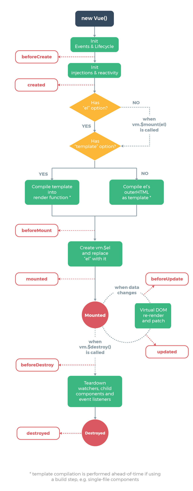

# Vue.js
## The Vue Instance
### Creating a Vue Instance
>Every Vue application starts by creating a new Vue instance with the Vue function.

每個 Vue 應用皆是透過 Vue 函數創建一個新的 Vue 實例開始。

```js
var vm = new Vue({
  // options
})
```
這邊官網說明雖然沒有完全遵循 MVVM 的模型，但是 Vue 的設計也受到這其中的啟發，因此文件中經常會使用 vm (ViewModel) 來表示 Vue 的實例。

---
### Data and Methods
>When a Vue instance is created, it adds all the properties found in its data object to Vue’s reactivity system. When the values of those properties change, the view will “react”, updating to match the new values.

當 Vue 實例被建立時，就會將 data 中的所有屬性加到 Vue 的響應式系統中。而這些值變化時，畫面也會隨之更新匹配新的值。

```js
// Our data object
var data = { a: 1 }

// The object is added to a Vue instance
var vm = new Vue({
  data: data
})

// Getting the property on the instance
// returns the one from the original data
vm.a == data.a // => true

// Setting the property on the instance
// also affects the original data
vm.a = 2
data.a // => 2

// ... and vice-versa
data.a = 3
vm.a // => 3
```

但這部分有需要特別注意的一點，也就是只有在實例被創建時就已經存在 data 中的屬性才是響應式的，若是一般的 `vm.b = 'hi'` ，那麼如果對 `b` 進行改變則不會有任何畫面上的更新。因此若我們知道在後續需要使用一個屬性，而他一開始為空或是不存在，那麼則需要為他在 data 中設定初始值，如下：

```js
data: {
  newTodoText: '',
  visitCount: 0,
  hideCompletedTodos: false,
  todos: [],
  error: null
}
```

另一點，除了數據屬性之外， Vue 實例還提供一些有用的實例屬性和方法。也就是在前面加上前綴 `$` ，以便於與用戶定義的屬性區分開來。

```js
var data = { a: 1 }
var vm = new Vue({
  el: '#example',
  data: data
})

vm.$data === data // => true
vm.$el === document.getElementById('example') // => true

// $watch is an instance method
vm.$watch('a', function (newValue, oldValue) {
  // This callback will be called when `vm.a` changes
})
```
---
### Instance Lifecycle Hooks
>Each Vue instance goes through a series of initialization steps when it’s created - for example, it needs to set up data observation, compile the template, mount the instance to the DOM, and update the DOM when data changes. Along the way, it also runs functions called lifecycle hooks, giving users the opportunity to add their own code at specific stages.

每個 Vue 實例在被創建時都需要經過一系列的初始化過程，例如需要設置數據監聽、編譯模板、將實例掛載到 DOM 上，以及當數據變化時更新 DOM 等，同時，在這過程之中也會運行 lifecycle hooks，這讓使用者能在不同階段中加入程式碼。

舉 `created` 來說，可用來在當一個實例被創建後時執行代碼：

```js
new Vue({
  data: {
    a: 1
  },
  created: function () {
    // `this` 指向 vm 实例
    console.log('a is: ' + this.a)
  }
})
// => "a is: 1"
```

這當中值得一提的是，在 lifecycle hooks 中的 `this` 為指向調用他的 Vue 實例。

因此這邊官網也有提到容易出現錯誤訊息的部分：

>Don’t use arrow functions on an options property or callback, such as 
    
    created: () => console.log(this.a) 
    or 
    vm.$watch('a', newValue => this.myMethod()). 

>Since an arrow function doesn’t have a this, this will be treated as any other variable and lexically looked up through parent scopes until found, often resulting in errors such as 

    Uncaught TypeError: Cannot read property of undefined or 
    Uncaught TypeError: this.myMethod is not a function.

避免使用箭頭函數，因為箭頭函數並沒有 `this` ， `this` 將會被當成變量一直往上層作用域尋找，一直到找到為止，因此經常導致錯誤。

---
### Lifecycle Diagram
最後附上經典的生命週期圖示

